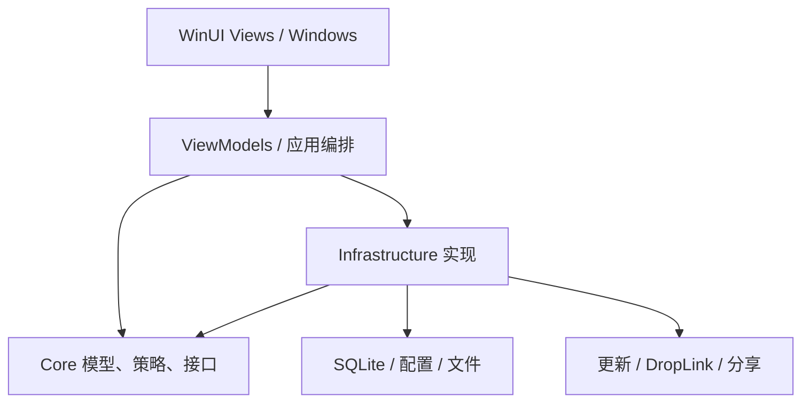

# DropSpace 底层架构审计与实施记录

基线：`53e2d8d64da6ad478cdf828969060235d94377ca`（Preview.16）。代码检查点：远端 `fa0f621d1ffb5cd86ada9608a84504c329413970`，对应本地 `48e564690152dd804f38dca2aa787622abff8058`；两者 tree 相同。本文取代此前“推送受阻”的中间报告。发布状态以 PR #50、对应 Actions 和公开 Release 为准，本文不预先宣称发布成功。

## 1. 原架构概述

项目采用 C#/.NET、WinUI 3、MVVM，生产代码分 App、Core、Infrastructure。App 同时承担组合根、Windows 适配与应用编排；Core 包含领域模型、策略、状态机与接口；Infrastructure 实现 SQLite、配置、文件、HTTP、加密和缓存。原有三项目划分合理，保留。没有引入第三方框架、数据库迁移或新的网络服务。

扫描包含全部受控源代码、测试、项目/依赖/构建配置、安装更新脚本、网站、Worker、文档与二进制资源。基线清单见 `inventory.md`；最终运行时代码快照见 `final-inventory.json`：505 个文件，103 个二进制文件，C#/XAML 源码和测试共 45,410 行。二进制按哈希记录。脚本逐个完整读取 Git blob，但正则提示不是逐行语义正确性或运行证据；关键运行链在此基础上人工追踪。

## 2. 发现的架构问题

| 问题 | 工程影响 | 实施边界 |
|---|---|---|
| 投影失败仍推进已应用修订号 | 同一修订无法重试、UI 长期陈旧 | 串行刷新协调器 |
| 两个 repository 各自维护写锁 | 同一 SQLite 的写入所有权分散 | 数据库实例共用写门 |
| 搜索/导航旧请求晚到 | 新页面被旧结果覆盖，忙状态错乱 | Main 查询修订 |
| 以最多 500 条可见列表覆盖总数 | Space 总数错误 | 数据库 COUNT 为权威 |
| 共享更新任务没有服务级取消/排空 | 退出后继续 IO，与资源释放竞争 | UpdateService |
| 重入退出不等待同一清理过程 | 后续清理可能跳过，投影仍运行 | App、Overlay、Undo |
| 自动跨设备剪贴板每事件异步发送 | 无界并发、无法排空、图像内存峰值 | 单消费者有界队列 |
| 外部文件预览按不变记录缓存 | 文件变更后显示旧内容 | 外部来源不缓存 |
| 缓存无明确总量/失效屏障 | 增长、清除后迟到任务重新写入 | 容量、TTL、代际 |
| MainViewModel 直接复制暂存文件 | UI/IO 耦合、取消遗漏后续暂存文件 | StagedFileImportService |
| 设置整对象竞争写入 | Pause 和更新检查时间被旧快照覆盖 | 原子字段更新 |
| 删除记录未覆盖预览缓存 | 派生数据残留 | Undo/历史清理/保留策略失效 |

## 3. 根因

这些问题主要来自异步工作的拥有者不明确，以及把“请求已发生”误当成“状态已提交”。独立锁不能表达同一数据库的写入边界；取消某个等待者也不等于取消服务拥有的共享操作；缓存写入完成时间不能决定它是否仍有资格写入。修复分别落实在数据库实例、服务生命周期、查询修订和缓存代际，而非增加通用 Manager 层。

## 4. 实施的修改与阶段

| 阶段 | 修改 | 逐步验证 |
|---|---|---|
| Phase 1 高风险修复 | 投影重试、数据库写锁、连接初始化失败释放 | Core 和数据库边界回归 |
| Phase 2 模块边界 | 暂存文件导入移入 Infrastructure，通过 DI 注入 | 导入成功/超限/外部源/取消测试 |
| Phase 3 状态管理 | 查询修订、权威总数、设置原子变更 | 投影与设置回归 |
| Phase 4 并发与生命周期 | 更新/App/Overlay/Undo 共享退出任务，自动剪贴板单消费者 | 更新取消、队列过载/故障/退出、Undo 回归 |
| Phase 5 IO/性能 | 图像读取预算、缓存配额/TTL/代际、元数据 IO 移出 UI | 缓存、内容边界与导入回归 |
| Phase 6 技术债 | 移除重复写锁、UI 文件处理、错误派生计数、非平台 async void | 差异检查与全仓复扫 |
| Phase 7 回归 | Core/Infrastructure/App、WinUI、安装更新、网站与 Worker | 见第 15 节与 Actions |

阶段按依赖交错小批提交，未积累全部修改后才第一次编译。保留既有窗口/Smart Drag/OLE 算法和原生线程边界。

## 5. 新架构说明

仍为三个项目。App 保留平台适配与交互编排；暂存内容的接收、复制、数据库提交及回滚由 Infrastructure 的专用导入服务负责。数据库、设置、更新任务、缓存和自动剪贴板各有明确的修改入口。已有合理抽象保留，不机械删除代码后置，也不引入泛化事件总线或 DI 框架。

## 6. 模块依赖关系

项目引用无循环。App 组合根负责注册，Windows/WinRT/COM 适配仍位于 App。项目级无循环不代表不存在对象级交叉引用；Main 与 Overlay 的投影订阅依然存在并有退出清理。

## 7. 状态流

SQLite 行保存项目身份、来源、固定和待删除状态；Main 列表、Overlay 和 COUNT 是查询投影。业务修订表示内容变化，查询修订表示哪次 UI 请求仍有效，两者不混用。只有成功应用投影才推进已应用修订。

JsonSettingsService 在一把门内读取当前值、执行 UpdateAsync、验证并持久化。Main 设置操作串行化；Pause 和最近更新检查时间按字段合并，检查时间不倒退。OverlayStateMachine 和 Smart Drag 会话 ID 继续分别管理窗口表现与原生拖拽授权。UpdateService snapshot 是更新状态来源；Undo 是一个槽位配合数据库 pending-delete token。

## 8. 数据流

普通外部文件：用户输入 → 应用编排 → repository 保存引用 → UI 投影；删除 DropSpace 记录绝不删除外部原文件。

虚拟/暂存文件：平台物化 → 受控 staging → StagedFileImportService 验证根目录及 reparse 边界 → 有界复制到自有 payload → 数据库提交 → 转移 payload 所有权 → 清理整个已接纳 staging 批次。失败/取消清理尚未提交的自有产物。

预览：共享内容解析 → provider → 有界可丢弃缓存 → UI；外部源绕过缓存。删除/历史清理/保留策略/启动 Undo 恢复清除派生缓存；旧代际写入不能重建已清除内容。

自动跨设备剪贴板：已有捕获事件 → 容量 16 的最新事件队列 → 单消费者 → 再次检查启用/Pause/对端 → 有界读取 → 网络发送。不增加轮询或云端采集。

## 9. 线程模型

WinUI 状态、HWND、OLE/COM 操作仍遵守原平台线程亲和性。查询结果仅在当前修订下回到 UI 应用。暂存文件和缓存目录维护通过工作线程执行。自动传播最多一个活动发送和 16 个排队事件，满队列丢弃最旧待处理事件；这是明确的外部行为变化，避免快速剪贴板变化积压旧内容。自动图像上限 10 MiB，手动发送上限 50 MiB。

共享更新操作同时接收服务生命周期令牌；单个调用者取消只结束自己的等待，不终止其他调用者共享的工作。事件处理保留必要的平台 async void，自动剪贴板事件改为同步入队。没有声称所有底层 IO 都已真正异步：Microsoft.Data.Sqlite 路径仍需 Windows 性能采样。

## 10. 生命周期模型

启动：参数/单实例路由 → DI/日志/兼容性 → 配置与语言 → 主 HWND → 数据库/Undo/剪贴板 → 可选网络服务 → 窗口/托盘/检测/热键 → 启动更新检查。`--startup` 仍不主动 Show/Activate。

退出：所有调用者共享 App 清理 Task → 取消启动工作并取消激活订阅 → 关闭窗口及窗口任务 → 容器异步释放 → 更新任务拒绝新工作并取消/排空 → Overlay 投影与 Undo 到期任务排空 → 释放令牌 → 最终日志 flush。每步独立记录清理失败并继续后续释放；具体容器服务顺序由 DI 注册/拥有关系决定。

禁用自动剪贴板先退订，再取消并等待队列工作退出，最后清空状态。数据库初始化失败释放连接；失败/取消等待写门不会释放别人的租约。Undo 退出共享同一个任务，失败保留数据库恢复依据。

## 11. 删除的技术债务

删除两个 repository 各自拥有的重复写锁；删除 Main 中暂存文件复制/删除实现；删除可见页覆盖总数；移除自动跨设备捕获事件的 async void；删除投影确认逻辑中失败也推进修订的隐含语义；消除部分双重 CTS 释放。没有按“未出现引用”机械删除反射、XAML 或平台回调代码。

## 12. 性能优化

预览缓存最多 64 项、总量 64 MiB、单项序列化 16 MiB、有效期 24 小时，过大预览可显示但不落缓存。旧缓存清理失败时禁止读取并在后续写入前重试。缓存故障不掩盖有效预览结果。

自动传播并发和积压有硬上限；图像流在完全物化前检查预算；暂存复制为流式且可取消。减少不必要缓存读取和过期 UI 更新。以上是代码路径及资源预算收益，未测量启动耗时、工作集或帧率，不提供虚构百分比。

## 13. 风险项

本次并非形式验证。原生窗口回收、睡眠唤醒、多屏热插拔、混合 DPI、Explorer/第三方虚拟文件、系统版本矩阵、无障碍、双设备断连恢复与真实 Worker 部署仍需目标环境验收。unsigned Preview 不改变发布者信任策略。缓存删除为尽力文件删除，不承诺安全擦除；文件锁失败有日志与重试。

## 14. 尚未修改的内容

MainViewModel 仍承担较多应用协调职责；后续按具体功能提取而非机械拆分。SQLite 的 async API 不保证后台执行，应先采样 UI 数据库热点。手动跨设备发送仍由调用方拥有，接收 HTTP 请求由 Host 拥有；自动队列修复不等于重写全部网络任务。原生热键/Overlay 仍有容器与窗口共同参与清理的边界，需真机资源检查。目录递归、reparse 组合及畸形媒体解析应继续做输入模糊测试；当前测试未证明全部恶意输入安全。没有调整网络协议或现有 schema。

## 15. 测试与验证结果

- Linux Core：171/171 通过。
- Linux Infrastructure：96 通过、6 失败；6 项均为基线已有的 Windows ProtectedData/DPAPI 平台不可用，不能视为全套通过。Windows 最新代码的 Infrastructure 测试步骤已通过。
- 定向回归：更新 30、设置 13、暂存导入 2、缓存代际 4 均通过（不同集合有重叠，不相加）。
- 网站：25/25；Worker：4/4。网站本地构建使用已有数据，仅证明构建/契约，不证明线上当前版本。
- Windows 代码检查点 `fa0f621`：Core/Infrastructure/App 测试和 WinUI Release 编译通过；完整安装/更新/卸载/双语 smoke/打包结果见 [Release validation](https://github.com/airanluo-dot/DropSpace/actions/runs/34168729047) 与 [Windows CI](https://github.com/airanluo-dot/DropSpace/actions/runs/34168729220)。最终发布提交须重新通过这些门禁。
- 全仓快照扫描无项目依赖循环；`scripts/audit-repository.py` 输出逐文件 SHA-256、Git blob、依赖和并发/事件/IO/清理提示。复现：`python scripts/audit-repository.py --revision HEAD --output audit.json`。快照记录自身 revision，后续文档和版本提交不改变该次代码快照身份。
- 未运行的真机矩阵保持 CONDITIONAL。最终公开资产和网站/API 验证由发布工作流及任务收尾报告单独确认。
