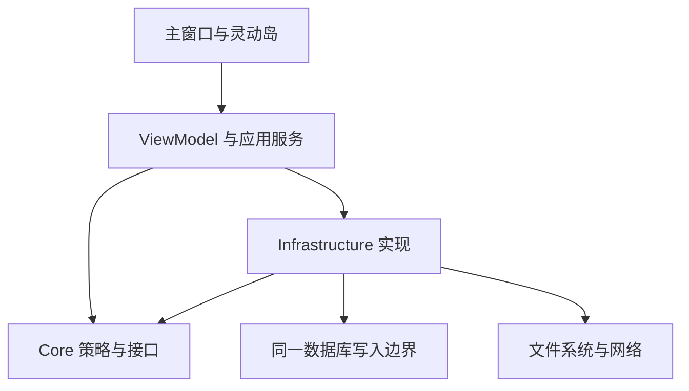

# DropSpace 底层架构审计与重构：阶段性交付

基线：`53e2d8d`，`v0.3.0-preview.16`。分支：`agent/architecture-audit-20260907`。

**任务尚未完成。** 本记录交付已实施的首批改动、已验证结果和下一步需要处理的具体问题，不把扫描覆盖率当作完整语义审计，不把 Linux 测试当作 Windows 验收。

## 1. 原架构概述

保留 App、Core、Infrastructure 三项目。App 同时承担 WinUI 窗口、Windows 适配器、应用编排和 DI 组合根；Core 放置领域模型、策略、状态机和接口；Infrastructure 负责 SQLite、文件、网络与加密。现有分层有工程价值，没有理由换技术栈或引入新的企业级框架。

仓库基线包含 494 个受控文件：391 个文本文件、103 个二进制资源。自动扫描逐个读取文件，记录 SHA-256、文件大小、行数、异步/事件/IO/释放特征。源代码与测试约 5.5 万行。完整清单见 `inventory.md`。源码调用链和生命周期深度审阅尚未全部完成。

## 2—4. 已确认问题、根因与修改

| 问题 | 根因 | 已实施修改 | 验证状态 |
|---|---|---|---|
| 投影失败后，同版本重试被当成成功 | 完成尝试与成功应用共用 AppliedRevision | 只在成功后推进版本；失败允许同版本显式重试，不自动无限重试 | Core 回归通过 |
| 失败通知后立即重试可能没有工作任务 | 发布失败与标记工作任务停止之间存在竞态窗口 | 在同一个锁内完成停止状态更新，然后通知失败调用方 | 100 轮异步失败/立即重试测试通过 |
| 两个仓库不能共同协调数据库写入 | 条目仓库和传输仓库分别持有写锁 | 写锁归属同一个 SqliteDatabase 实例，两个仓库复用 | 存储/迁移/撤销/写入边界 27 项通过 |
| 数据库连接打开或 PRAGMA 失败时未完成所有权移交 | 连接创建后缺少异常释放路径 | 成功后才返回连接；失败先释放再抛出；预先取消不创建目录 | 编译及相邻数据库测试通过；未注入每一种原生失败 |
| 主列表的旧查询覆盖新页面或搜索 | 多个 ReloadAsync 没有结果有效性校验 | 查询版本号控制结果应用；导航与搜索输入立即使旧结果失效；旧任务不重置新任务忙碌状态 | Windows 编译与界面运行待验证 |
| Space 总数被截断成最多 500 | 总数错误地来自当前显示页 Items.Count | 删除覆盖，沿用数据库 CountAsync 的权威总数 | Windows 界面运行待验证 |

未修改外部源文件、数据库结构、网络信任规则、配置格式、最低 Windows 版本、依赖版本或发布版本号。

## 5—6. 当前架构与模块依赖

项目引用关系没有环：App → Core、Infrastructure；Infrastructure → Core。类之间的回调与状态传播不能仅靠项目图证明没有隐式依赖，仍需继续审阅。

## 7. 状态流

数据库条目是身份、来源、固定状态和待删除状态的权威来源；Pinned 是状态而不是另一份存储。MainViewModel 的 SpaceRevision 通知灵动岛重新投影；失败的刷新不再宣称已经应用。主列表查询版本只控制请求新旧关系，不充当业务数据版本。SpaceItemCount 仍来自数据库总数。

OverlayStateMachine 管理隐藏、拖拽准备、紧凑、展开和退出等生命周期；Smart Drag 使用独立会话 ID 和 OLE 证据授权显示。没有把所有 bool 机械替换成状态机，也没有增加第二套条目存储。

## 8. 数据流

文件输入从主窗口、灵动岛、OLE、Shell 或 Share 进入应用编排，检查引用、保存条目与批次元数据、更新总数和版本，再投影到界面。虚拟文件先进入受控暂存区，再成为应用自有载荷；目前 MainViewModel 仍直接打开和清理暂存文件，属于待整理边界。

剪贴板由系统通知进入有界队列，读取与标准化后检查暂停/提交条件，先保存载荷再保存条目。动作通过共同内容解析器读取来源并生成新的输出文件。更新通过可信元数据、流式下载、校验和安装适配器传递，不放宽信任边界。

## 9. 线程模型

WinUI、HWND 和 COM/OLE 操作保留所属线程。剪贴板后台消费者、拖拽信号队列、快捷键消息线程和网络请求分别有自己的执行边界。新增数据库写锁只统一互斥，并不意味着 SQLite 已变成真正非阻塞 IO；其 async 外观和 ConfigureAwait(false) 不能证明 UI 不阻塞，该问题仍需专项处理。

## 10. 生命周期模型及待修复缺口

启动：解析参数与单实例重定向 → 构建服务 → 能力检查 → 配置与语言 → 主窗口/剪贴板 HWND → 数据库/撤销/剪贴板 → 可选分享 → 托盘/显示器/拖拽/快捷键 → 启动更新检查。

原退出路径存在以下已定位缺口，**尚未修改**：

- 重复退出调用立即返回，未等待同一退出任务完成。
- 一步清理抛错可能跳过后面的释放。
- 窗口与 DI 容器交叉释放同一个注入服务。
- OverlayViewModel 取消投影后没有等待其异步退出。
- UpdateService 的调用方取消只终止等待，底层共享操作缺少服务生命周期取消。
- CrossDeviceClipboardService 使用非平台事件 async void 传播捕获；取消订阅不会取消已开始的传播，禁用后的身份字段变化还需要和异步读取统一处理。

## 11. 删除的技术债务

本批删除了两个仓库各自的写锁和主列表对权威总数的错误覆盖。保留有实际消费者的历史兼容值、包装层与平台代码；没有为了减少文件或行数批量删除模块。

## 12. 性能优化与证据边界

统一数据库写入互斥可避免两个仓库在应用内无序竞争同一数据库；请求版本校验防止过期查询继续创建界面投影；失败重试不会进行无上限自动循环。尚未测量 CPU、内存、启动耗时或磁盘 IO，因此不报告百分比改善，也不宣称已完成性能优化阶段。

## 13—14. 风险与后续处理

| 目标 | 已定位事实 / 下一步 |
|---|---|
| 预览缓存 | FilePreviewCache 没有容量/寿命上限，键缺少外部文件修改版本；读取 JSON 缺少文件大小边界；ClearAsync 没有生产调用方，需要连通隐私清理与源变更失效 |
| 更新任务 | 为共享操作补充生命周期取消和可等待释放，同时保留每个调用方单独取消等待 |
| 退出 | 建立所有调用方共同等待的退出任务；停止输入、取消任务、等待任务、释放平台对象、最后刷新日志 |
| 应用边界 | MainViewModel 的暂存文件打开/删除应迁移到现有文件服务或有明确职责的输入服务，不机械拆类 |
| 设置 | 不同运行快照与读改写事务之间的并发仍需验证，不能仅增加缓存掩盖状态失同步 |
| 原生窗口 | 保持无激活、无任务栏、Smart 隐藏态不占输入、多屏 DPI 和 OLE 线程所有权，需要真实 Windows 回归 |
| 错误模型 | 逐项区分可恢复失败、任务取消、不可恢复启动失败；统一后再移除重复错误展示 |
| 性能热点 | SQLite UI 阻塞、缩略图重复加载、日志每条打开文件及缓存持久化成本需测量后决定 |

## 15. 测试与交付状态

| 验证 | 结果 |
|---|---|
| Core 原基线 | 166 通过 |
| Core 最终本地回归 | 169 通过 |
| Infrastructure 原基线 | 85 通过，6 项 Windows DPAPI 不受 Linux 支持 |
| Infrastructure 最终本地回归 | 87 通过，相同 6 项平台失败，合计 93 |
| 数据库/迁移/撤销专项 | 27 通过 |
| Share Worker | 4 通过 |
| App 本地编译 | 依赖恢复、Core/Infrastructure 编译完成；Windows XamlCompiler.exe 在 Linux 报 Exec format error，App 未验证 |
| 复扫 | 重新读取全部当时受控文件；项目引用无环；未新增第三方依赖；差异空白检查通过 |
| Windows CI / 原生运行 | 未执行 |
| PR / 推送 / Preview / 官网 API | 未完成 |
| 两份维护技能同步 | 尚未完成，不声明架构任务完成 |

普通 git push 两次被自动审批拒绝。第一次拒绝后再次核实了 GitHub 插件返回的 public 仓库属性、用户 admin/push 权限及实际 push URL，确认目标是 `airanluo-dot/DropSpace`；第二次审批仍以未明确授权远端源码发布、目的地未可信为由拒绝。没有改用其他写工具绕过拦截。

由于 Windows 阶段编译门槛无法执行，七阶段工作没有全部完成。当前交付仅为可审阅、可恢复的本地首批修改。后续必须从 Windows CI 验证开始，继续深度审计、剩余重构、技能同步、发布和真实运行验收。
