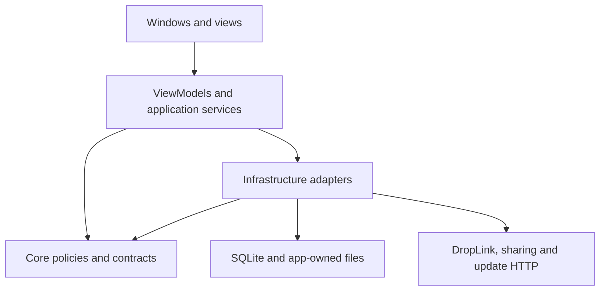

# DropSpace architecture audit — working record

Baseline: 53e2d8d / v0.3.0-preview.16. This is an implementation work log; pending gates are not acceptance claims.

## Original architecture and dependencies

The production graph contains three projects: App references Core and Infrastructure; Infrastructure references Core; Core references neither. Project references have no cycle. App is both the composition root and the Windows adapter/application layer, so the project graph is not itself a strict UI-only boundary. MainViewModel orchestrates persistence, settings, clipboard, updates, actions and placement. MainPage contains presentation plus preview/share orchestration. OverlayWindowService owns monitor surfaces and native drag ownership; OverlayViewModel projects MainViewModel's Space revision through a serialized refresh coordinator. Core owns domain contracts, policies, overlay/drag state machines, version selection and bounded transfer policies. Infrastructure owns SQLite, files, network transport, crypto and derived caches.

The App composition root uses validated singleton registrations. Platform-specific adapters remain in App where WinUI/WinRT apartment ownership requires it. A fourth project, broad interface layer, new DI framework or mechanical elimination of code-behind is not justified.

## Lifecycle model

Launch parses maintenance/shell/startup arguments, redirects secondary instances through AppInstance, builds services, starts diagnostics, checks Windows capabilities, loads/migrates settings, chooses localization, creates MainWindow and its stable clipboard HWND, initializes the repository/Undo/clipboard pipeline, initializes opt-in sharing, starts tray/monitor/drag/hotkey ownership and finally schedules the startup update check. Startup launches must not Show/Activate the main window. SQLite migration validates schema and preserves the original on failure. Partial feature initialization is best effort and local workspace recovery remains distinct from network capability failure.

Original shutdown sets an integer once, nulls the service provider, cancels only the app startup-check waiter, closes overlay/main windows, disposes the container, then drains file logging. Duplicate callers return immediately. Exceptions can skip later steps. OverlayWindowService also disposes injected view-model/foreground services; MainWindow disposes its injected view-model; the DI container subsequently disposes them again. OverlayViewModel cancels its asynchronous projection without awaiting it. The updater uses shared tasks with per-caller cancellation, but underlying shared work has no service-owned shutdown token. These are separate ownership defects, not cosmetic issues.

## State and data flow

| State | Authority | Projection / boundary |
|---|---|---|
| Item identity, pin, source, pending-delete | SQLite item rows | Main list and overlay are projections; no second item store |
| Total Space count | Repository COUNT | Must never derive from the 500-item visible page |
| Overlay lifecycle | OverlayStateMachine | OverlayViewModel snapshot; native/UI adapters apply it |
| Smart drag | Session policy and session ID | Pointer evidence never alone authorizes visible file acceptance |
| Persisted preferences | JsonSettingsService | MainViewModel/clipboard settings are runtime snapshots; settings transaction rolls back external side effects |
| Preview bytes/text | Source item or confined payload | Disk preview cache is disposable derived data |
| Update state | UpdateService snapshot | UI notifications; verified files/state store for recovery |
| DropLink receive state | Host session under mutation/finalization ownership | Transfer repository records durable session metadata |
| Undo | One coordinator slot + pending-delete token | Only app-owned unreferenced payloads can be reclaimed |

File intake enters MainViewModel from main/overlay/OLE/shell/share adapters, inspects references, persists item/batch metadata, updates the canonical count/revision and refreshes projections. Virtual-file Drop first materializes into owned staging; MainViewModel currently also opens/deletes staging files directly, a remaining application/file-system boundary debt. Clipboard notifications enter a bounded event-driven channel, normalize within configured budgets, respect pause/commit barriers, persist payload then item, and publish content-free status. Actions resolve source semantics through IItemContentResolver and write new output files. Updates parse trusted metadata, stream/hash downloads, verify integrity/publisher trust and launch installation only through the deployment adapter.

## Thread model

UI state, HWND, COM/OLE and WinUI image objects have apartment ownership. Clipboard capture uses a bounded background consumer and UI dispatch only for platform access. Smart drag separates lossy pointer movement from reliable critical events. Hotkeys and native observers own message threads. Network hosts use asynchronous request handlers and serialized session/lifecycle gates. SQLite uses async-shaped APIs but native operations may still execute synchronously; ConfigureAwait(false) alone is not evidence of a nonblocking UI boundary. File/network streaming and bounded decode policies are retained.

## Verified findings and implemented changes

1. Projection failure incorrectly advanced AppliedRevision. Root cause: one counter represented both terminal attempts and successful projection. Fixed: errors complete waiters without claiming state application; explicit same-revision retry is supported and automatic failure spinning is prevented. Core baseline 166 tests; after two regression tests, 168 passed.
2. SQLite item and transfer repositories each held a private write lock. Root cause: synchronization scoped to repository rather than shared database. Fixed: one database-owned write gate; repository transactions keep their current boundaries. Connection ownership now transfers only after Open/PRAGMA succeeds; failed initialization releases the connection. Already-cancelled initialization does no storage IO. Targeted storage/migration/Undo/write-boundary tests: 27 passed.
3. Main list reloads could complete out of order and overwrite a new page/search; a previous request could reset the new request's busy state. Fixed: monotonically increasing request revision checked before applying UI state, including invalidation at search change and navigation. Removed the page-sized overwrite of the canonical Space count. Windows compilation/runtime validation pending.

## Preservation decisions and technical debt

Keep the three projects, native adapter boundary, Core state machines, short-lived SQLite connections, schema/version contracts, source-safe file semantics, caller cancellation on shared update waits, bounded streaming, localization and release fail-closed behavior. Do not remove historical compatibility values or wrappers until their consumers and persisted contracts are proven absent. Do not add runtime packages for architecture aesthetics.

Remaining review/implementation targets include orderly shutdown completion; update/shared-work cancellation; cross-device capture task ownership; cache freshness/capacity/privacy invalidation; main-page preview lifetime; synchronous SQLite work; settings snapshot/update concurrency; staging IO in MainViewModel. Presence in this list is not a claim that each has been fixed.

## Validation and risk ledger

- Full tracked-file automated inventory: 494 files, 391 UTF-8 text, 103 binary resources. Detailed hashes in inventory.md. Structural scans cover tasks/events/IO/disposal across every source file. Deep semantic review is ongoing; do not equate regex coverage with completed manual review.
- Core baseline: 166 passed. First fix: 168 passed.
- Infrastructure baseline on Linux: 85 passed, 6 fail with PlatformNotSupportedException from Windows DPAPI. No test was disabled to hide these failures. Windows CI is required.
- Share Worker: 4 passed.
- Phase 2 storage/migration/Undo regression gate: 27 passed.
- WinUI App, Windows DPAPI, installer/upgrade/uninstall, OLE/native HWND, mixed DPI/monitor, real provider, two-device LAN, Worker/browser deployment, release assets and live website/API gates remain unverified.
- No quantitative CPU, memory, startup or IO performance improvement is claimed without measurement.
- Skill synchronization and final rescan are pending; release is not complete.

## Checkpoint validation and execution block

Final local Core run: 169/169 passed, including immediate asynchronous failure/retry races. Final Infrastructure run: 87 passed, the same 6 Windows DPAPI failures as baseline, 93 total. Worker baseline: 4/4 passed. The full tracked-file rescan found no project-reference cycle; dependency package versions are unchanged. Whitespace validation passed. App restore and referenced Core/Infrastructure compilation succeeded; Linux could not execute the Windows XamlCompiler.exe (Exec format error), so App compilation is NOT validated.

Two ordinary pushes to the verified public airanluo-dot/DropSpace repository were rejected by automatic approval review. The stated reason was that remote source publication was not specifically authorized and the destination was not trusted. GitHub metadata was rechecked (public repository, user admin/push access) and the exact push URL matched, but the second review still rejected it. No alternate write tool or other route was used to bypass that rejection. No PR, remote commit, release or deployment is claimed.

The initial seven-phase request remains incomplete. Further mutating phases are held at the requested Windows build gate. Complete skill synchronization and remote verification when the implementation can resume; both skills are currently unmodified. The local branch and patch preserve reviewable work. Remaining code review must not be represented as a completed full semantic audit.
